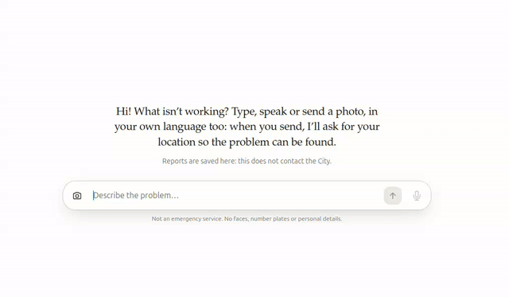

# SegnalaMi

**Claude Impact Lab Milano · 3 October 2026 · Track `<01 | 02 | 03>`**

**One line:** for anyone in Milan who runs into an accessibility barrier — describe it in
one sentence, in any language, and find out immediately which public body is responsible
and how to reach them, instead of guessing between nine phone numbers and a SPID login.

**Demo:** three screencasts below · full walkthrough in [DEMO.md](DEMO.md)

> **This is a prototype, not an official City of Milan service.** It does not transmit
> reports to any authority and does not monitor them for emergencies. Every example
> below is fictional.

---

## The problem

It's 08:40 on a Tuesday. Someone using a wheelchair comes up to the lift at M3 Lodi and
it's out of service again. There's no alternative route out of the station.

To report it they have to already know things nobody knows: that the lift belongs to
ATM and not to the Comune; that ATM takes reports through a web form and an infoline,
not the Comune's reporting portal; that the Comune's portal would want SPID, a photo and
a street address — and that a metro station isn't a street address, so the form fights
them anyway. The Comune's own reporting centre covers seven categories, and the barrier
in front of them is in none of them.

So most people do the rational thing and report nothing. The barrier stays. The body
that could fix it never finds out, and the absence of a report reads, from the inside,
as the absence of a problem.

**The hard part of civic reporting in Milan is not writing the report. It is knowing who
to send it to.**

## What we built

A chat. The person describes the barrier the way they would describe it to another
person, and the system does the rest.

1. **Describe it.** Type it, record it in any language (transcribed on-device-to-server
   by Whisper, then shown for review before sending), or photograph it. One composer,
   one gesture. No category picker, no address field, no recipient field, no account.
2. **Send.** The browser is asked for location at that moment. Refusing, or a timeout,
   never blocks the report.
3. **It's saved** — receipt underneath with a report number, coordinates linked to a map,
   and the time. This happens before and independently of anything else.
4. **It's understood and routed.** A second card appears: *Chi se ne occupa* — the
   responsible body, named, with its hours and stated response time, and a single
   one-tap action: a `tel:` link that dials, or a button that opens that body's own form.
5. **It says what it did not do.** *"Niente è stato inviato: questo passaggio lo fai tu."*
   The last step is the person's, and the card never pretends otherwise.

For the M3 Lodi lift, the card names **ATM — Azienda Trasporti Milanesi**, opens ATM's
contact form, and notes their stated ten-day response. The person typed one sentence.

If the text suggests immediate danger, routing is short-circuited before any body is
chosen: the card turns red and says to call 112, because a queue is the wrong place for
that report.

### Watch it

**A broken lift at M3 Lodi → ATM.** The report saves, then the card names the body, its
hours and its stated 10-day response, and offers one button.



**An exposed cable → 112.** Routing is short-circuited before any body is chosen.


**Waste blocking a pavement → Amsa.** Same pipeline, different competence, and a `tel:`
link instead of a form.


Full videos: [1 · ATM](docs/demo-1-atm-lift.mp4) · [2 · emergency](docs/demo-2-emergency.mp4) · [3 · Amsa](docs/demo-3-amsa-waste.mp4).
The four-beat script is in [DEMO.md](DEMO.md).

In all three, the last line of the card is the same: *"Nothing has been sent: this step is
yours to take."*

## The routing backend

The chat is one half. The other is
**[segnalazioni-impact-lab-be](https://github.com/fabianhogger/segnalazioni-impact-lab-be)**
— a Java 21 / Spring Boot service that holds the competence table, classifies the report,
and decides who is responsible. Keeping it separate is deliberate: the competence table is
a civic artefact the Comune should be able to correct without touching an app.

**How they talk.** One HTTP call, made in parallel with the chat reply, never in series:

```
POST {ROUTING_URL}/api/v1/reports     { text, latitude?, longitude? }
  → 201 { status, analysis{category,…}, nextStep{agencyId,action,message,deeplink} }
```

It is best-effort by design. If the backend is slow, down or unconfigured, the report
still saves, the receipt still appears, and the routing card is simply absent — no error
for the citizen to decode. The client ([`src/routing.ts`](src/routing.ts)) has an 8-second
timeout, sheds load, validates the response shape, and never throws. Coordinates outside
Milan are dropped rather than sent; a report with no text never leaves at all; no contact
field is ever transmitted, because there is none to transmit.

### The services it routes to

Nine bodies, 17 categories, defined in
[`agencies.yml`](https://github.com/fabianhogger/segnalazioni-impact-lab-be/blob/main/src/main/resources/agencies.yml)
as configuration rather than code. The service refuses to start if two bodies claim the
same category.

| Body | Covers | Channel | Can we deliver it? |
| --- | --- | --- | --- |
| **ATM** | metro, tram, bus, BikeMi — *the lift in our demo* | web form + infoline | No — citizen submits |
| **Amsa** | waste, illegal dumps, bulky items, syringes | phone 800 33 22 99, PULIamo app | No — citizen calls |
| **Comune — reporting centre** | roads, street cleaning, urban furniture, public green, cemeteries, abandoned vehicles, street lighting | web form, SPID/CIE | No — citizen submits |
| **Unareti** | electrical faults, blackouts | phone 803500 | No — citizen calls |
| **Polizia Locale** | non-urgent policing, illegal parking | phone 020208 | No — citizen calls |
| **ARPA Lombardia** (via the Comune) | noise, pollution, spills | phone, via the Comune | No — citizen calls |
| **Comune — outreach unit** | people sleeping rough | phone 02 8844 7646 | No — citizen calls |
| **Comune — 020202** | anything uncategorised, and every low-confidence report | phone / WhatsApp | No — citizen calls |
| **Comune — SOS Affitti** | irregular rentals | **e-mail** | **Yes** — the one body with an address to write to |

**Eight of nine say "no", and that is the finding, not the bug.** No public body in Milan
publishes a reporting API, so for everything except one mailbox the service stops one step
short and hands the citizen a ready-to-send packet instead. We will not close that gap by
automating a SPID session, replaying a private app's endpoints, or submitting someone
else's form — those are unauthorised, not merely difficult.

What the repo does instead is leave the seam open and visible. `AgencyAdapter` declares
two methods — which channel it speaks, and how to dispatch — and the API adapter is
checked in deliberately empty, because there is nothing yet to call. When a body opens an
endpoint, the work is one new class plus one line of YAML; nothing else in either repo
changes. The ask that makes that possible is
[`municipality-handoff.md`](https://github.com/fabianhogger/segnalazioni-impact-lab-be/blob/main/docs/municipality-handoff.md).

Even the one e-mail channel ships with the safety off: sending is dry-run by default and
a recipient must be on an explicit allowlist, so a real municipal inbox cannot be written
to by accident. Two tests exist solely to keep it that way.

## Where Claude works

Claude runs **three times per report**, at runtime, for three different jobs. None of
this is build-time tooling; remove Claude and the product is a form that saves text.

### Models

| Where | Model | Mode |
| --- | --- | --- |
| Chat acknowledgement | `claude-opus-5` (`CLAUDE_MODEL`) | messages, `effort: low`, vision, server-side refusal fallback |
| Triage assessment | `claude-opus-5` (`CLAUDE_MODEL`) | strict tool use (`assess_report`), vision |
| Competence routing | `claude-opus-5-5` | structured outputs against a typed schema, `effort: low` |

Voice is **Groq Whisper** (`whisper-large-v3-turbo`), not Claude.

### What it does at runtime

- **Understands free text in any language.** No category picker exists because Claude
  reads the sentence. "L'ascensore della stazione M3 Lodi è rotto" becomes
  `TRASPORTO_PUBBLICO`, and the location `stazione M3 Lodi`.
- **Reads the photo.** The triage assessment is multimodal: the sanitised JPEG goes to
  Claude alongside the text, so a photo of a blocked ramp contributes to the assessment
  rather than sitting as an attachment.
- **Extracts a location from how people actually speak.** Not an address field — a
  station, a stop, a landmark, a street and civic number, whichever the person gave.
- **Decides who is responsible,** mapping 17 categories onto 9 real Milan bodies, each
  with its own channel: a form, a phone line, an app, or a mailbox.
- **Judges urgency** on a 1–5 rubric, and separately flags immediate danger.
- **Asks instead of guessing.** When something essential is missing, it returns the
  question rather than filing an unactionable report.
- **Writes the handoff.** The pre-filled text the person reads out or pastes into the
  body's form is Claude's neutral restatement, not the raw message.

### Prompts and tools

| What | Where |
| --- | --- |
| Chat reply system prompt | [`src/assistant.ts`](src/assistant.ts) — `SYSTEM_PROMPT` |
| Triage prompt + `assess_report` tool schema | [`src/operations/assessor.ts`](src/operations/assessor.ts) — `ASSESSMENT_PROMPT` |
| Routing prompt | [`ClassifierPrompt.java`](https://github.com/fabianhogger/segnalazioni-impact-lab-be/blob/main/src/main/java/it/milano/segnalazioni/adapter/out/llm/ClassifierPrompt.java) |
| Routing output schema | [`Classification.java`](https://github.com/fabianhogger/segnalazioni-impact-lab-be/blob/main/src/main/java/it/milano/segnalazioni/domain/Classification.java) — the record *is* the JSON schema; its `@JsonPropertyDescription` text is prompt |
| Competence table | [`agencies.yml`](https://github.com/fabianhogger/segnalazioni-impact-lab-be/blob/main/src/main/resources/agencies.yml) — configuration, not code |

Routing uses **structured outputs**, so `category` and `severity` are constrained to
their enum values by the API and there is no output parsing to go wrong. Triage uses
**strict tool use** with `tool_choice: auto`. No MCP servers: the only outbound calls are
to the two public bodies' published contact points, which the citizen makes themselves.

### What Claude decides, and what a human confirms

Claude decides **the category, the location reading, the urgency and the suggested body**.
A human confirms **everything that leaves the building** — because nothing leaves
automatically. The one-tap action is a suggestion; the person reads the card, sees which
body was chosen, and chooses to call or not. That is the human confirmation step, and it
is the citizen's rather than a clerk's.

Three more gates sit behind it:

- **A confidence floor.** Below 0.6 the report is not routed to a guessed body at all; it
  goes to the Comune's general information line, which is staffed by people.
- **Officer override.** The triage layer stores `priority_override` and
  `department_override` so a human can correct Claude's assessment without it being
  recomputed over them.
- **Dry-run and an allowlist** on the only channel that can transmit by itself. Both are
  on by default; a real public mailbox cannot be written to by accident, and two tests
  exist solely to keep it that way.

### What happens when it's wrong

| Failure | What happens |
| --- | --- |
| Wrong body chosen | The person sees the body named on the card before acting, and simply doesn't act. Where a report is e-mailed, the message footer asks the recipient to reply with the correct body; that reply is the correction signal. |
| Not confident | Routed to a human information line instead of a guess. |
| Missing information | The report is not filed; the question is put back to the person. |
| Danger misread as routine | The prompt is instructed to resolve the URGENT/EMERGENZA boundary *towards* emergency: a false alarm costs one phone call, a false negative costs more than this service is worth. |
| Claude unreachable, slow, or refuses | The report still saves. The chat falls back to a fixed bilingual confirmation; the routing card is simply absent. There is no error state for the citizen to decode, and no spinner that never ends. |
| Prompt injection in the report text | Report text and photos are delimited and declared untrusted evidence in all three prompts. Structured outputs and a strict tool schema mean a successful injection cannot change the response shape — at worst a category, which the confidence floor and the visible card catch. |
| Malformed or surprising response | Validated on arrival (`parseAssessment`, `toNextStep`); anything unexpected degrades to "no card" rather than a crash. |

**Known gap, stated plainly:** there is no eval set. Prompt changes are currently judged
by reading outputs. Fifty real reports labelled by someone who knows the competences
would change that, and it is the first thing we would build with a week more.

## City data and sources

No open dataset is consumed at runtime yet. What the routing depends on is a **competence
table** we assembled by hand from published municipal and operator sources, and every row
carries its own provenance and a verification flag in
[`agencies.yml`](https://github.com/fabianhogger/segnalazioni-impact-lab-be/blob/main/src/main/resources/agencies.yml).

| Source | How we used it | Confidence |
| --- | --- | --- |
| comune.milano.it — online reporting centre (retrieved 3 Oct 2026) | The seven categories the Comune accepts, the SPID/CIE requirement, and which categories demand a photo | Confirmed |
| Amsa — toll-free 800 33 22 99 and the PULIamo app (retrieved 3 Oct 2026) | Waste, illegal dumps, bulky items, syringes; 24/7 phone as the routing target | Confirmed |
| ATM — contact page and infoline 02 48 607 607 (retrieved 3 Oct 2026) | Transit reports; the form URL, infoline hours and the stated 10-day response | Confirmed |
| Comune di Milano — 020202 information line | Fallback for uncategorised and low-confidence reports | Partial — confirmed as an information line; **not** confirmed that it opens a formal case |
| ARPA Lombardia, via the Comune | Noise and environmental reports | Partial — the Comune holds competence for noise; ARPA's own operations-room number not confirmed |
| Comune — SOS Affitti mailbox | Irregular rentals; the only body we can transmit to without permission | Partial — address confirmed in 2023, needs re-confirming |
| Polizia Locale 020208 · Unareti 803500 · Comune outreach 02 8844 7646 | Non-urgent policing, electrical faults, rough sleeping | **Unverified** — secondary sources, flagged `verified: "no"` in the config |
| Milan bounding box (45.3–45.6 N, 9.0–9.4 E) | Rejects coordinates outside the city rather than routing them | — |

Marking what we could not verify is deliberate: an unverified phone number in a civic
service is a failure mode, and the first ask in our handoff document is for the Comune to
confirm these nine rows.

**A version 2 would read real data:** the CKAN open-data portal and the geoportal
WMS/WFS endpoints are public HTTP APIs available today, and would let us validate that an
address exists, resolve it to its NIL and Municipio, and detect that a barrier has already
been reported nearby. That is read-only and needs no permission — we ran out of hours,
not access.

## Day one

What the Comune would need to switch this on, cheapest first. The full argument, written
in Italian and addressed to the relevant directorates, is
[`municipality-handoff.md`](https://github.com/fabianhogger/segnalazioni-impact-lab-be/blob/main/docs/municipality-handoff.md).

**Costs nothing, takes days**
- Confirm the nine rows of the competence table, especially the three marked unverified.
- Tell us whether 020202 opens a formal case or only informs.

**Costs very little, takes weeks**
- One monitored mailbox per body that accepts machine-generated reports, with a stated
  owner and the confirmation that photo attachments are acceptable. This alone closes the
  last step for the first body willing to try it.

**The actual ask**
- `POST /segnalazioni` returning a **real case number**, synchronously. Without one, a
  citizen cannot tell a report that was worked from a report that was ignored — and that
  distinction is the entire difference between a service that builds trust and one that
  spends it. A JSON contract is proposed in the handoff document.
- A way to read case status, even just open / in progress / closed.
- An explicit rejection for incompetence, naming the right body — which is also how the
  routing gets corrected.

**People and permissions**
- A DPO decision on controller/processor roles before the first real transmission.
- A rule on photographs of public space, which routinely contain faces and plates: who
  redacts, and what the retention period is.
- A decision on anonymous reports, which this service currently assumes are acceptable.

**Version 2 would add** the open-data reads above, an eval set built from real reports,
a Trenord/RFI entry (railway lifts are currently nobody's row in our table), one unified
classification instead of three Claude calls, and the officer dashboard the triage
backend was built for but which has no UI yet.

## Run it

Requires **Node.js 22.18+** (it runs TypeScript and SQLite natively, no build step).
For the routing half, **Java 21** and **Maven**.

```bash
git clone https://github.com/FlXZ22/impact-lab.git
cd impact-lab
npm install
cp .env.example .env          # add your ANTHROPIC_API_KEY
npm start                     # http://127.0.0.1:3000
```

That runs the chat on its own: reports save to SQLite, photos to `data/uploads`, both
created on first start. Without an API key everything still works and the chat answers
with a fixed confirmation.

**For the full demo**, including the routing card, you also need the dispatch service
([segnalazioni-impact-lab-be](https://github.com/fabianhogger/segnalazioni-impact-lab-be)) checked out beside this repo. Clone it into
`segnalazioni_ai`, which is where `demo.sh` looks for it:

```bash
cd ..
git clone https://github.com/fabianhogger/segnalazioni-impact-lab-be.git segnalazioni_ai
cd impact-lab
./demo.sh                     # starts both, waits for both, prints the URL
# or: ANTHROPIC_API_KEY=sk-... ./demo.sh
```

`demo.sh` needs Java 21 and Maven for that half. Override the location with
`ROUTING_REPO=/path/to/repo ./demo.sh`.

Then open **http://127.0.0.1:3000** — use `127.0.0.1`, not a LAN IP: geolocation and the
microphone need a secure context. Follow [DEMO.md](DEMO.md).

| Script | What it does |
| --- | --- |
| `npm start` / `npm run dev` | Serve the app (`dev` restarts on changes) |
| `npm test` | API and repository tests (Postgres contract runs when `TEST_DATABASE_URL` is set) |
| `npm run typecheck` | `tsc --strict` over the server (`.ts`) and the browser code (JSDoc-typed `.js`) |
| `npm run check` | Both of the above |

Optional keys: `GROQ_API_KEY` enables the microphone; `ROUTING_URL` points at the
dispatch service (defaults to off, in which case no routing card appears).

If the page says "the running server is an old version", stop the server and run
`npm start` again — an old process is still serving the old API.

## Team

| Name | Role | GitHub |
| --- | --- | --- |
| Antonio | `<role>` | `<@handle>` |
| Ali | `<role>` | [@FlXZ22](https://github.com/FlXZ22) |
| Fabian | `<role>` | [@fabianhogger](https://github.com/fabianhogger) |
| Gabriele | `<role>` | `<@handle>` |
| Alessio | `<role>` | `<@handle>` |

## Licence

MIT. Built at the Claude Impact Lab Milano and donated to the Comune di Milano.

---

# Reference

Everything below is implementation detail for whoever picks this up.

## How a report flows

1. The person types, records a voice message, or picks a photo. Recordings (MediaRecorder,
   WebM/Opus or MP4 on Safari, max 2 minutes) go to `POST /api/transcriptions`, then to
   Groq Whisper, and the text lands in the field for review before sending. Whisper's
   typical silence captions are discarded. Photos are downscaled and re-encoded in the
   browser, which also drops EXIF/GPS metadata.
2. On send, the browser is asked for its position. Denial, timeout (12 s) or missing
   support never block: the report is sent with `latitude`/`longitude` null.
3. The server validates the input, rejects obvious contact details and number plates,
   re-sanitizes the photo with `sharp` (orientation, max 1600 px, metadata stripped),
   stores it, and inserts the row. If the insert fails, the stored photo is removed.
4. Claude writes a one- or two-sentence acknowledgement, and — in parallel, never in
   series — the dispatch service is asked which body is responsible. Both are
   best-effort: the report is already saved, and either can fail without the citizen
   seeing an error.
5. The chat shows the receipt, and the routing card when there is one. Failed sends keep
   their draft in memory and offer Retry.

## Data model

| Column | Type | Notes |
| --- | --- | --- |
| `id` | uuid / text | Generated |
| `content_text` | text, ≤ 2000 | Null for photo-only reports |
| `image_url` | text | `/uploads/<uuid>.jpg` locally, public Storage URL on Supabase |
| `latitude`, `longitude` | double | Both null or both set; range-checked |
| `status` | `open` \| `received` \| `in_progress` \| `resolved` | Default `open`; history in `report_status_events` |
| `created_at` | timestamptz / ISO text | Default now |

The database enforces the same rules the API checks: there must be text or a photo, and
coordinates come in pairs. Schemas live in `db/sqlite/` and `db/postgres/` as numbered
migrations, applied automatically on start and tracked in `schema_migrations`.

## API

| Method | Path | Body / query | Result |
| --- | --- | --- | --- |
| `POST` | `/api/reports` | `{ text?, image?: { media_type, data(base64) }, latitude?, longitude?, language: 'it'\|'en' }` | `201 { report, reply, nextStep }` |
| `GET` | `/api/reports` | `?limit=1..200` (default 50) | Newest first |
| `GET` | `/api/reports/progress` | `?ids=id1,id2` | Status + timeline per report |
| `GET` | `/api/reports/:id` | | One report |
| `PATCH` | `/api/reports/:id` | `{ status }` | Updated report |
| `POST` | `/api/transcriptions` | raw audio body (`audio/webm`, `audio/mp4`, `audio/ogg`, …, ≤ 10 MB), `?language=it\|en` | `{ text }` |
| `GET` | `/api/config` | | `{ assistant, transcription, maxTextLength }` |
| `GET`/`PATCH` | `/api/operations/*` | | Triage queue, priority and department overrides |

`nextStep` is `null` whenever routing is off, unreachable, or had nothing to say.

Writes must be same-origin JSON (audio for transcriptions). Report creation is limited to
12 and transcription to 30 per client per minute. Errors are `{ code, message }`. **There
is no authentication:** anyone who can reach the server can list reports and change
statuses, so keep it on a trusted network or put it behind auth before exposing it.

## Report status: what the citizen sees

Every report moves through four steps, each change recorded with its time in
`report_status_events`:

| `status` | Step shown to the citizen (IT / EN) | Who sets it |
| --- | --- | --- |
| `open` | Inviata / Sent | automatically on creation |
| `received` | Consegnata al Comune / Delivered to the City | City dashboard |
| `in_progress` | Presa in carico / In progress | City dashboard |
| `resolved` | Risolta / Resolved | City dashboard |

This is a **separate axis** from the dispatch service's own status
(`AWAITING_CITIZEN_ACTION`, `SENT`, …), which describes the handoff rather than the work.

- **City dashboard → status:** `PATCH /api/reports/:id` with `{ "status": "received" }`.
  Setting the same status twice records nothing; reopening is allowed and shown.
- **Citizen → progress:** `GET /api/reports/progress?ids=a,b,c` (≤ 50) returns
  `[{ id, status, timeline }]`, never the report content. The page polls every 30 s while
  visible.
- The page remembers reports sent from that device (localStorage) under **Le mie
  segnalazioni**, with a compact four-dot tracker under each message.

## Architecture

```
server.ts                  entry: config → storage → assistant → router → HTTP
src/app.ts                 routes, security headers, error mapping
src/domain/                Report types, validation, personal-data guard
src/repository/types.ts    ReportRepository: the storage contract
src/repository/sqlite.ts   default adapter (node:sqlite)
src/repository/postgres.ts PostgreSQL / Supabase adapter (pg)
src/storage/               ImageStore contract + local disk and Supabase Storage adapters
src/assistant.ts           best-effort Claude reply, with fallback
src/routing.ts             best-effort call to the dispatch service, with null fallback
src/operations/            triage: assessor (strict tool use), durable queue worker, overrides
src/transcription/         Transcriber contract + Groq Whisper adapter
public/                    static client: app.js orchestrates js/chat-stream.js,
                           js/input-dock.js, js/voice.js, js/geo.js, js/photo.js
```

Routes depend on the `ReportRepository`, `ImageStore`, `Assistant`, `Transcriber` and
`Router` interfaces only. `src/routing.ts` and `src/assistant.ts` share one contract
shape: `enabled`, a factory, never throws, explicit timeout, load shedding, fallback.

Switching storage engines is a single environment variable, `STORAGE_DRIVER`:

| `STORAGE_DRIVER` | Reports | Photos | Needs |
| --- | --- | --- | --- |
| `local` (default) | SQLite file | `data/uploads` | nothing |
| `postgres` | any PostgreSQL 13+ | `data/uploads` | `DATABASE_URL` |
| `supabase` | Supabase Postgres | Supabase Storage | `DATABASE_URL`, `SUPABASE_URL`, `SUPABASE_SERVICE_ROLE_KEY` |

Adding another engine means one class implementing `ReportRepository` and one `case` in
`src/storage/index.ts`.

## Voice transcription (Groq)

1. Create a key at console.groq.com → API Keys.
2. In `.env`: `GROQ_API_KEY=gsk_…` (optionally `GROQ_WHISPER_MODEL=whisper-large-v3` for
   maximum accuracy instead of the faster turbo model).
3. Restart. The log shows `transcription: groq whisper-large-v3-turbo`.

## Switching to Supabase

1. **Create a project** at supabase.com and note its reference (`https://<project-ref>.supabase.co`).
2. **Get the connection string:** Dashboard → Connect → *Session pooler* (IPv4-friendly):
   `postgresql://postgres.<project-ref>:<password>@aws-0-<region>.pooler.supabase.com:5432/postgres`.
3. **Get the TLS certificate:** Dashboard → Database → Settings → SSL Configuration →
   *Download certificate*. Save as `certs/supabase-ca.crt` (git-ignored). The adapter
   always verifies hosted servers. As a quick start only, append `?sslmode=no-verify` to
   `DATABASE_URL`, which encrypts without verifying the server.
4. **Get the service role key:** Project Settings → API keys → `service_role` (secret).
   It stays on the server and is used only for Storage uploads.
5. **Configure `.env`:**
   ```bash
   STORAGE_DRIVER=supabase
   DATABASE_URL=postgresql://postgres.<project-ref>:<password>@aws-0-<region>.pooler.supabase.com:5432/postgres
   DATABASE_CA_CERT=certs/supabase-ca.crt
   SUPABASE_URL=https://<project-ref>.supabase.co
   SUPABASE_SERVICE_ROLE_KEY=<service_role key>
   SUPABASE_BUCKET=report-images
   ```
6. **Start:** `npm start`. On boot the adapter applies `db/postgres/*.sql` under an
   advisory lock and creates the public `report-images` bucket if absent (JPEG only,
   5 MB cap). The log shows `storage: supabase`.

To manage the schema yourself, run `psql "$DATABASE_URL" -f db/postgres/001_create_reports.sql`.
The startup migration then sees the table and skips it. The table has row-level security
enabled with no policies, so Supabase's public `anon` key cannot read or write reports;
only the server's direct connection can. Photo URLs are public but unguessable (UUIDs),
and their metadata is stripped.

Existing SQLite data is not migrated automatically.

## Accessibility and privacy

WCAG 2.2 AA is the floor, which for a tool aimed at disabled people is the minimum
defensible position rather than an achievement.

- Every control works by keyboard and has a label; new replies, save/fail states and
  transcription are announced through one polite live region; Escape cancels a recording;
  touch targets are at least 44 px; text scales with browser settings; reduced motion is
  respected; light and dark themes follow the system.
- No accounts, names or contact fields. The conversation lives in the tab
  (`sessionStorage`) and is gone when the tab closes.
- Photos are stripped of EXIF and GPS twice: in the browser, then again server-side with
  `sharp`. Obvious e-mail addresses, phone numbers and Italian plates are rejected before
  a report is stored.
- The routing call never sends a contact field — there is nothing to send, by design.
- Voice recordings pass through this server to Groq and are never stored; only the text
  you then choose to send is saved. Without `GROQ_API_KEY` the microphone says
  transcription is off and everything else works.
- To swap Groq for another speech-to-text service, implement `Transcriber`
  (`src/transcription/types.ts`) and change the one line in `server.ts` that creates it.
