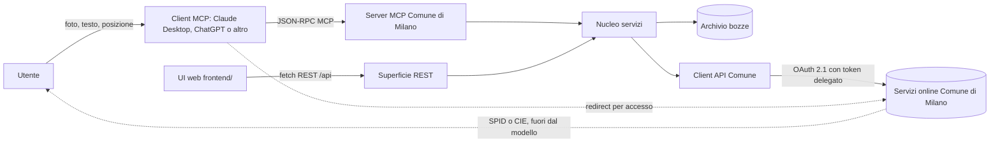
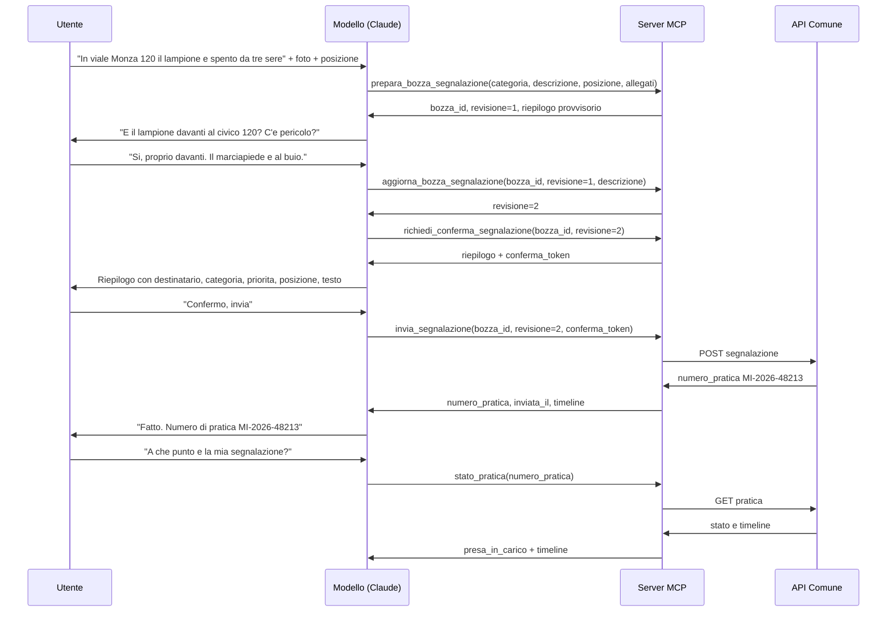
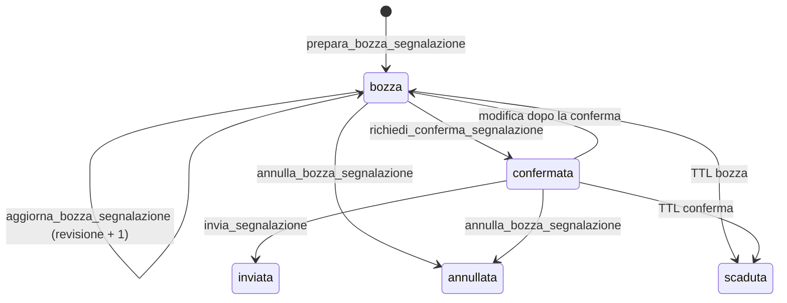
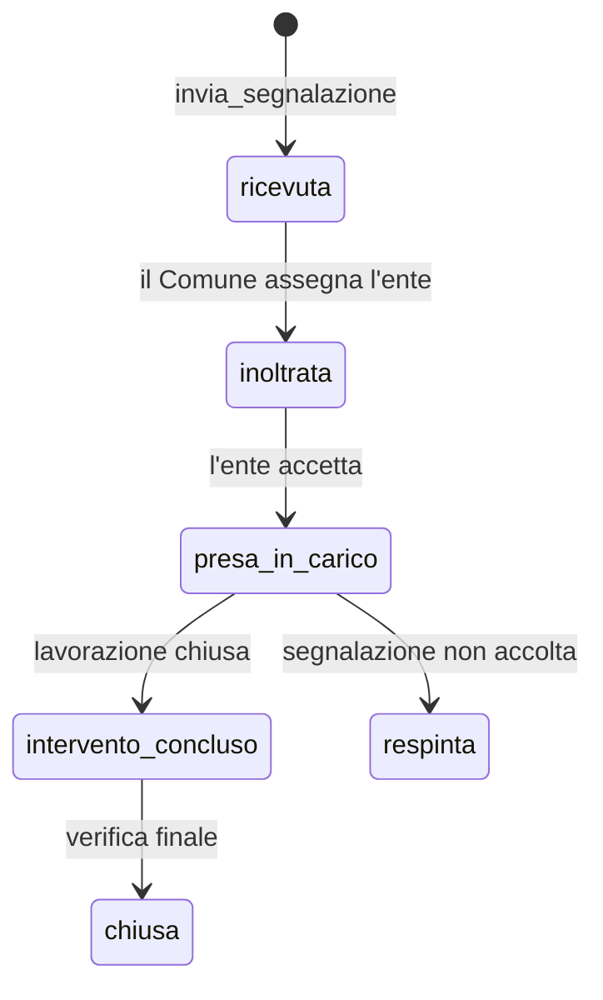

# Architettura del server MCP Comune di Milano - Segnalazioni

> **NON COLLEGATO AL PRODOTTO.** Questo server MCP e' uno studio di progettazione per una
> futura interfaccia del Comune, non un componente di SegnalaMi. Non viene avviato da
> nessuna parte: la registrazione in `.mcp.json` e' disattivata e `mcp/` e' escluso dalla
> build e dalla CI.
>
> Attenzione leggendo il codice: il `comuneClient` descritto nella documentazione **non e'
> mai stato implementato**. `src/backend.ts` chiama l'API di SegnalaMi
> (`SEGNALAMI_API_URL`, default `http://127.0.0.1:3000`), non un backend del Comune. Le
> bozze stanno in memoria di processo e le pratiche inviate in
> `~/.config/segnalami-mcp/pratiche.json`, quindi `elenco_pratiche` elenca solo le
> segnalazioni inviate da quella singola macchina.
>
> La parte che conta e' `contracts/`: e' la specifica piu' chiara che abbiamo di bozze,
> chiavi di idempotenza, timeline di stato e tassonomia degli errori, e guidera' l'API
> definitiva. Vedi `docs/consolidation-plan.md` nel repo del backend.

Il sistema espone il connettore "Comune di Milano - Segnalazioni" come server Model Context Protocol (MCP): il modello prepara una bozza, l'utente la conferma in modo esplicito, il server la invia e restituisce numero di pratica e timeline. L'autenticazione SPID o CIE resta fuori dal modello e le credenziali non transitano mai dal server MCP.

Questo documento definisce architettura, contratti dei tool, schemi dati, modello errori, sicurezza e modalita di avvio. I contratti leggibili da una macchina vivono in `contracts/`. Il codice del server e la UI web sono deliverable dei task collegati (vedi "Stato di implementazione").

## Confini non negoziabili

- L'accesso con SPID o CIE avviene sul sito del Comune. Il server MCP non riceve, non memorizza e non registra credenziali, OTP o codici di accesso.
- Il server MCP riceve solo un token di autorizzazione delegata, con ambiti limitati, emesso dal connettore del Comune.
- Nessun invio avviene senza una conferma esplicita dell'utente. La conferma e un vincolo server-side, non un'istruzione nel prompt.
- Il modello non puo leggere le pratiche di altri cittadini: ogni richiesta e legata al soggetto del token.

## Componenti



Il nucleo applicativo e unico. MCP e REST sono due adattatori sottili sullo stesso servizio, cosi il modello e la UI web applicano le stesse regole di validazione, conferma, idempotenza e sicurezza.

| Componente | Responsabilita | File di riferimento previsti |
| --- | --- | --- |
| Server MCP | Registrazione tool, validazione input, traduzione errori, trasporti | `src/server.ts`, `src/index.ts` |
| Tool | Un file per tool, schema Zod e chiamata al servizio | `src/tools/*.ts` |
| Nucleo servizi | Bozze, conferma, invio, stato, idempotenza | `src/services/*.ts` |
| Client Comune | Chiamate HTTP al backend del Comune, gestione token e retry | `src/services/comuneClient.ts` |
| Superficie REST | Endpoint per `frontend/` | `src/http/*.ts` |
| Contratti | Tool, errori, esportazione OpenAI | `contracts/*.json` |

## Flusso end-to-end

Il percorso riproduce il mockup: descrizione con foto, domande di chiarimento, riepilogo, conferma, invio, ricevuta e consultazione.



## Mappa dei tool MCP

Tre famiglie: preparazione, conferma e invio, consultazione. I nomi sono stabili e identificano l'operazione; le descrizioni sono in italiano perche guidano il comportamento del modello.

| Tool | Quando si usa | Effetto esterno | Annotazioni |
| --- | --- | --- | --- |
| `prepara_bozza_segnalazione` | L'utente descrive un problema con una posizione | Nessuno | `readOnlyHint:false`, `destructiveHint:false`, `idempotentHint:true` |
| `aggiorna_bozza_segnalazione` | Correzioni o "Cambia destinatario" | Nessuno | `idempotentHint:false` |
| `richiedi_conferma_segnalazione` | Prima di mostrare il riepilogo finale | Nessuno, emette un token a scadenza | `idempotentHint:false` |
| `invia_segnalazione` | Dopo un "si" esplicito dell'utente | Crea una pratica | `destructiveHint:true`, `idempotentHint:true` |
| `stato_pratica` | L'utente chiede a che punto e | Nessuno (sola lettura) | `readOnlyHint:true` |
| `elenco_pratiche` | L'utente chiede le sue pratiche | Nessuno (sola lettura) | `readOnlyHint:true` |
| `annulla_bozza_segnalazione` | L'utente rinuncia alla bozza | Elimina una bozza non inviata | `destructiveHint:true` |

Dettaglio dei contratti: `contracts/mcp-tools.json`. Ogni tool dichiara `inputSchema` e `outputSchema` in JSON Schema 2020-12. La validazione runtime usa gli stessi vincoli espressi con Zod.

### Perche la conferma e un tool separato

`richiedi_conferma_segnalazione` congela la revisione corrente e restituisce un `conferma_token` monouso. `invia_segnalazione` rifiuta la chiamata se il token manca, e scaduto o non corrisponde alla revisione. Il modello non puo quindi inviare per errore: deve prima passare dal riepilogo e ottenere il token. Questo rende la conferma verificabile dal server, non solo dichiarata nel prompt.

Se il client MCP supporta `elicitation`, il server puo usarla come conferma aggiuntiva nella UI del client. La conferma obbligatoria resta il token, perche non tutti i client implementano `elicitation`.

## Macchina a stati

### Bozza



Una bozza scade dopo 24 ore di inattivita. Il `conferma_token` scade dopo 10 minuti (configurabile). Ogni modifica incrementa la revisione e annulla la conferma precedente.

### Pratica



Le etichette di timeline visibili all'utente sono quelle del mockup: Ricevuta, Inoltrata, Presa in carico, Intervento concluso. Gli stati macchina sono in `snake_case`.

## Schemi dati

### Bozza di segnalazione

```json
{
  "bozza_id": "6a1f2c40-9d5b-4c2a-9c31-7f0d2a1b8e44",
  "revisione": 2,
  "stato": "confermata",
  "categoria": "illuminazione_pubblica",
  "sottocategoria": null,
  "priorita": "media",
  "destinatario": { "codice": "A2A_IP", "nome": "A2A Illuminazione Pubblica" },
  "posizione": {
    "indirizzo": "Viale Monza 120, lato numeri pari",
    "lat": 45.5031,
    "lon": 9.2099,
    "precisione": "civico",
    "riferimenti": "marciapiede davanti al portone"
  },
  "descrizione": "Lampione spento da tre sere davanti al civico 120 di viale Monza, lato numeri pari. Il marciapiede e completamente al buio.",
  "allegati": [
    { "id": "att_01H...", "tipo": "foto", "mime": "image/jpeg", "nome": "lampione.jpg", "dimensione_byte": 234567 }
  ],
  "canale": "claude_connector",
  "lingua": "it-IT",
  "creata_il": "2026-10-03T21:40:12+02:00",
  "aggiornata_il": "2026-10-03T21:44:03+02:00",
  "scade_il": "2026-10-04T21:40:12+02:00"
}
```

Campi e vincoli principali:

| Campo | Tipo | Vincolo |
| --- | --- | --- |
| `categoria` | string | Una delle 7 categorie in `contracts/mcp-tools.json` |
| `priorita` | string | `bassa`, `media`, `alta`. Default `media` |
| `posizione.indirizzo` | string | 3 a 200 caratteri |
| `posizione.lat` / `lon` | number | Facoltativi, intervallo geografico valido |
| `descrizione` | string | 10 a 2000 caratteri, testo per l'ufficio |
| `allegati` | array | Massimo 5, fino a 10 MB ciascuno |
| `revisione` | integer | Parte da 1, cresce a ogni modifica |

### Riepilogo di conferma

Il riepilogo e la vista che il modello mostra all'utente. Corrisponde ai campi del mockup.

```json
{
  "bozza_id": "6a1f2c40-9d5b-4c2a-9c31-7f0d2a1b8e44",
  "revisione": 2,
  "riepilogo": {
    "destinatario": "A2A Illuminazione Pubblica",
    "categoria": "Illuminazione pubblica",
    "priorita": "Media",
    "posizione": "Viale Monza 120, lato numeri pari",
    "testo_per_ufficio": "Lampione spento da tre sere davanti al civico 120..."
  },
  "conferma_token": "eyJhbGciOiJIUzI1NiIsInR5cCI6IkpXVCJ9...",
  "scade_il": "2026-10-03T21:54:03+02:00"
}
```

### Ricevuta e pratica

```json
{
  "numero_pratica": "MI-2026-48213",
  "bozza_id": "6a1f2c40-9d5b-4c2a-9c31-7f0d2a1b8e44",
  "inviata_il": "2026-10-03T21:47:10+02:00",
  "destinatario": { "codice": "A2A_IP", "nome": "A2A Illuminazione Pubblica" },
  "stato_corrente": "presa_in_carico",
  "timeline": [
    { "stato": "ricevuta", "etichetta": "Ricevuta", "raggiunto": true, "timestamp": "2026-10-03T21:47:10+02:00" },
    { "stato": "inoltrata", "etichetta": "Inoltrata ad A2A", "raggiunto": true, "timestamp": "2026-10-03T21:48:02+02:00" },
    { "stato": "presa_in_carico", "etichetta": "Presa in carico", "raggiunto": true, "timestamp": "2026-10-05T09:12:44+02:00" },
    { "stato": "intervento_concluso", "etichetta": "Intervento concluso", "raggiunto": false, "timestamp": null }
  ],
  "aggiornata_il": "2026-10-05T09:12:44+02:00"
}
```

Il formato del numero di pratica segue `^[A-Z]{2}-[0-9]{4}-[0-9]{5}$`, per esempio `MI-2026-48213`.

### Allegato

```json
{
  "id": "att_01H...",
  "tipo": "foto",
  "mime": "image/jpeg",
  "nome": "lampione.jpg",
  "dimensione_byte": 234567
}
```

Formati ammessi: `image/jpeg`, `image/png`, `image/webp`, `application/pdf`. Il contenuto non viene mai registrato nei log. I metadati EXIF GPS vengono rimossi se il client invia un'immagine, salvo consenso esplicito a conservare la geolocalizzazione.

## Conferma esplicita e idempotenza

Il `conferma_token` e un JWT firmato HMAC-SHA256 dal server. Il payload contiene:

| Campo | Significato |
| --- | --- |
| `sub` | Soggetto autenticato dal connettore |
| `bozza_id` | Bozza confermata |
| `revisione` | Revisione congelata |
| `hash` | SHA-256 del JSON canonico (RFC 8785) della bozza |
| `exp` | Scadenza, 10 minuti per default |
| `jti` | Identificativo monouso |

`invia_segnalazione` verifica firma, scadenza, soggetto, revisione, hash e consumo del `jti`. Se una modifica cambia l'hash, il token diventa inutilizzabile e la risposta e `TOKEN_CONFERMA_NON_VALIDO`.

L'idempotenza usa `chiave_idempotenza` su `prepara_bozza_segnalazione` e `invia_segnalazione`. Il server conserva la mappa chiave, soggetto e risultato per 24 ore e restituisce la stessa risposta a un retry con gli stessi dati. Una chiave riusata con dati diversi produce `CHIAVE_IDEMPOTENZA_IN_CONFLITTO`.

## Modello errori

Ogni errore di tool restituisce `isError: true`, un testo leggibile e un `structuredContent` con la stessa forma. Gli errori di protocollo (per esempio metodo mancante) usano gli errori JSON-RPC standard.

```json
{
  "codice": "CONFERMA_RICHIESTA",
  "messaggio": "Serve una conferma esplicita dell'utente prima dell'invio.",
  "categoria": "dominio",
  "rimediabile": true,
  "retry_dopo_ms": null,
  "dettagli": { "bozza_id": "6a1f...", "revisione": 2 },
  "azione_suggerita": "Chiama richiedi_conferma_segnalazione, mostra il riepilogo e attendi un si esplicito.",
  "correlazione_id": "req_01H..."
}
```

Catalogo completo: `contracts/errori.json`. Codici principali:

| Codice | HTTP | Categoria | Rimediabile |
| --- | --- | --- | --- |
| `INPUT_NON_VALIDO` | 400 | validazione | si |
| `NON_AUTENTICATO` | 401 | autenticazione | no |
| `AUTORIZZAZIONE_NEGATA` | 403 | autorizzazione | no |
| `BOZZA_NON_TROVATA` | 404 | dominio | si |
| `BOZZA_SCADUTA` | 410 | dominio | si |
| `CONFERMA_RICHIESTA` | 409 | dominio | si |
| `TOKEN_CONFERMA_NON_VALIDO` | 409 | dominio | si |
| `CONFLITTO_REVISIONE` | 409 | dominio | si |
| `CHIAVE_IDEMPOTENZA_IN_CONFLITTO` | 409 | dominio | no |
| `PRATICA_NON_TROVATA` | 404 | dominio | si |
| `SEGNALAZIONE_RESPINTA` | 422 | dominio | no |
| `ALLEGATO_TROPPO_GRANDE` | 413 | limite | si |
| `FORMATO_ALLEGATO_NON_SUPPORTATO` | 415 | limite | si |
| `TROPPE_RICHIESTE` | 429 | limite | si |
| `SERVIZIO_COMUNE_NON_DISPONIBILE` | 503 | dipendenza | si |
| `ERRORE_INTERNO` | 500 | interno | si |

Regole di comportamento:

- Gli errori di dipendenza (`503`, `429`) si ritentano con backoff esponenziale e jitter, mantenendo la stessa chiave di idempotenza.
- `SEGNALAZIONE_RESPINTA` non si ritenta. Va mostrata all'utente con il motivo.
- `NON_AUTENTICATO` e `AUTORIZZAZIONE_NEGATA` non si ritentano. Richiedono una nuova azione dell'utente.
- Il server non fa trapelare stack trace o dettagli interni nel testo mostrato al modello.

## Sicurezza e privacy

### Accesso e token

Il connettore del Comune e un server OAuth 2.1. Il client MCP segue il flusso Authorization Code con PKCE, reindirizza l'utente al sito del Comune e riceve un access token legato a quel soggetto.

- Il server MCP pubblica i metadati della risorsa protetta (RFC 9728) e pretende un token con audience propria (RFC 8707).
- Ambiti richiesti: `segnalazioni:scrittura` e `pratiche:lettura`. Il modello vede una descrizione leggibile degli ambiti, non il token.
- Il token di accesso e di breve durata. Il refresh avviene fuori dal modello, nel client.
- In modalita stdio il token arriva da un file con permessi `0600` o dal portachiavi di sistema. Non compare mai in prompt, commenti o log.

### Dati e log

- I log non contengono descrizioni, indirizzi, immagini o token. Registrano solo identificativi, codici di errore, tempi e numero di pratica.
- Il contenuto delle segnalazioni si conserva sul server solo per il tempo necessario alla bozza e all'invio. Le bozze scadono dopo 24 ore.
- Gli allegati si elaborano in una cartella temporanea e si eliminano dopo l'inoltro.
- Gli errori non includono il contenuto dell'utente. I dettagli sono limitati a campi e identificativi.

### Abusi e integrita

- Rate limit per soggetto: 30 chiamate al minuto e 10 invii all'ora per default.
- `conferma_token` monouso, legato alla revisione, con scadenza breve.
- Idempotenza sugli invii per impedire pratiche duplicate.
- La superficie REST accetta solo origini in allowlist e richiede il token delegato. Il browser non conserva mai il token in `localStorage`; la UI web parla con il proprio backend, che gestisce la sessione.
- Validazione degli allegati su tipo MIME reale, dimensione ed estensione.

## Trasporti e avvio

Tre modalita, tutte dallo stesso entrypoint. Streamable HTTP e la modalita consigliata per un connettore remoto. stdio serve allo sviluppo locale e ai client desktop. SSE resta per compatibilita con client piu vecchi.

| Modalita | Flag | Endpoint | Uso |
| --- | --- | --- | --- |
| stdio | `--transport stdio` | stdin/stdout | Sviluppo locale, Claude Desktop |
| Streamable HTTP | `--transport http` | `POST/GET/DELETE /mcp` | Connettore remoto di produzione |
| SSE (legacy) | `--transport sse` | `GET /sse`, `POST /messages` | Client che non supportano Streamable HTTP |

Comandi previsti dal contratto (richiedono la build del server, vedi "Stato di implementazione"):

```bash
# dipendenze e build
npm install
npm run build

# sviluppo locale su stdio
node dist/index.js --transport stdio

# server HTTP con Streamable HTTP
node dist/index.js --transport http --host 127.0.0.1 --port 8787 --path /mcp

# compatibilita SSE
node dist/index.js --transport sse --host 127.0.0.1 --port 8787

# ispezione interattiva dei tool
npx @modelcontextprotocol/inspector node dist/index.js --transport stdio

# controllo di salute del server HTTP
curl -s http://127.0.0.1:8787/healthz
```

Variabili d'ambiente:

| Variabile | Default | Significato |
| --- | --- | --- |
| `COMUNE_MCP_TRANSPORT` | `stdio` | `stdio`, `http` o `sse` |
| `COMUNE_MCP_HOST` | `127.0.0.1` | Interfaccia di ascolto HTTP |
| `COMUNE_MCP_PORT` | `8787` | Porta HTTP |
| `COMUNE_MCP_PATH` | `/mcp` | Percorso Streamable HTTP |
| `COMUNE_API_BASE_URL` | nessuno | Base URL delle API del Comune |
| `COMUNE_MCP_TOKEN_FILE` | nessuno | File `0600` con il token delegato per stdio |
| `COMUNE_MCP_CONFERMA_TTL_S` | `600` | Scadenza del `conferma_token` |
| `COMUNE_MCP_BOZZA_TTL_S` | `86400` | Scadenza della bozza |
| `COMUNE_MCP_MAX_ALLEGATO_MB` | `10` | Dimensione massima per allegato |
| `COMUNE_MCP_LOG_LEVEL` | `info` | Livello di log |

## Configurazione di Claude Desktop

Aggiungi il server a `claude_desktop_config.json`:

- macOS: `~/Library/Application Support/Claude/claude_desktop_config.json`
- Windows: `%APPDATA%\Claude\claude_desktop_config.json`
- Linux: `~/.config/Claude/claude_desktop_config.json`

```json
{
  "mcpServers": {
    "comune-milano-segnalazioni": {
      "command": "node",
      "args": [
        "/percorso/assoluto/mcp-comune-milano/dist/index.js",
        "--transport",
        "stdio"
      ],
      "env": {
        "COMUNE_API_BASE_URL": "https://api.comune.milano.example/v1",
        "COMUNE_MCP_TOKEN_FILE": "/percorso/assoluto/.config/comune-milano/token.json"
      }
    }
  }
}
```

Dopo il riavvio di Claude Desktop, i sette tool compaiono nella lista. Per un connettore remoto, configura invece l'URL Streamable HTTP `https://<host>/mcp` come connettore e lascia che Claude esegua il flusso OAuth verso il sito del Comune.

## OpenAI Function Calling

Gli stessi schemi si esportano nel formato `tools` di OpenAI. La fonte unica resta `contracts/mcp-tools.json`; `contracts/openai-tools.json` e la snapshot generata.

```bash
node scripts/export-openai-tools.mjs
```

Esempio d'uso lato client OpenAI:

```js
import fs from "node:fs";
const { tools } = JSON.parse(fs.readFileSync("contracts/openai-tools.json", "utf8"));

const completion = await client.chat.completions.create({
  model: "gpt-4.1",
  messages,
  tools,
  tool_choice: "auto",
});
```

`strict` e impostato a `false` perche i contratti ammettono campi opzionali. Per abilitare lo strict mode di OpenAI serve una variante con tutti i campi obbligatori e `additionalProperties: false` su ogni oggetto: il generatore puo produrla quando il server marca ogni campo come obbligatorio. OpenAI non esegue MCP in modo nativo: per collegare ChatGPT al server serve un bridge che traduce le function call in chiamate MCP.

## Superficie REST per la UI web

La UI in `frontend/` (task MET-56) parla con questi endpoint. Il modello non li usa; passano dallo stesso nucleo servizi e applicano le stesse regole di conferma.

| Metodo e percorso | Scopo | Corpo o risposta |
| --- | --- | --- |
| `GET /healthz` | Liveness | `{ "stato": "ok" }` |
| `GET /readyz` | Readiness, include le dipendenze | `{ "stato": "ok", "dipendenze": {} }` |
| `POST /api/allegati` | Carica un allegato (multipart) | `{ "file_id", "mime", "nome", "dimensione_byte" }` |
| `POST /api/segnalazioni/bozze` | Crea una bozza | Corpo `BozzaInput`, risposta `Bozza` |
| `GET /api/segnalazioni/bozze/{bozza_id}` | Legge una bozza | `Bozza` |
| `PATCH /api/segnalazioni/bozze/{bozza_id}` | Aggiorna una bozza | Corpo con `revisione`, risposta `Bozza` |
| `DELETE /api/segnalazioni/bozze/{bozza_id}` | Annulla una bozza | `{ "bozza_id", "stato": "annullata" }` |
| `POST /api/segnalazioni/bozze/{bozza_id}/conferma` | Emette il riepilogo e il token | `{ "riepilogo", "conferma_token", "scade_il" }` |
| `POST /api/segnalazioni` | Invia la bozza confermata | Corpo `{ bozza_id, revisione, conferma_token, chiave_idempotenza? }`, risposta `Ricevuta` |
| `GET /api/segnalazioni` | Elenca le pratiche | `{ "pratiche": [], "prossimo_cursore": null }` |
| `GET /api/segnalazioni/{numero_pratica}` | Stato di una pratica | `Pratica` |

Esempio completo di invio:

```bash
curl -s -X POST http://127.0.0.1:8787/api/segnalazioni/bozze \
  -H 'Content-Type: application/json' \
  -d '{
    "categoria": "illuminazione_pubblica",
    "priorita": "media",
    "descrizione": "Lampione spento da tre sere davanti al civico 120 di viale Monza.",
    "posizione": { "indirizzo": "Viale Monza 120, lato numeri pari", "precisione": "civico" }
  }'
```

Errori REST: stessa forma del modello errori, con `codice`, `messaggio`, `dettagli` e `correlazione_id`, e lo status HTTP della tabella.

## Struttura di riferimento del repository

```text
mcp-comune-milano/
├── README.md
├── docs/
│   └── architecture.md
├── contracts/
│   ├── mcp-tools.json
│   ├── openai-tools.json
│   └── errori.json
├── scripts/
│   ├── export-openai-tools.mjs
│   └── validate-contracts.mjs
├── frontend/
│   ├── index.html
│   ├── styles.css
│   └── app.js
├── src/
│   ├── index.ts
│   ├── server.ts
│   ├── tools/
│   ├── services/
│   ├── schemas/
│   └── http/
├── package.json
└── tsconfig.json
```

`frontend/` e il deliverable di MET-56. `src/` e il deliverable di MET-55, che deve rispettare i contratti in `contracts/`.

## Verifica dei contratti

Questi comandi girano oggi, senza dipendenze esterne, e controllano i file in `contracts/`.

```bash
# genera la snapshot OpenAI dagli schemi MCP
node scripts/export-openai-tools.mjs

# verifica campi, nomi unici, allineamento OpenAI e catalogo errori
node scripts/validate-contracts.mjs

# verifica sintattica dei singoli file
python3 -m json.tool contracts/mcp-tools.json > /dev/null
python3 -m json.tool contracts/errori.json > /dev/null
```

Il validatore esce con codice 0 e stampa "Tutti i contratti sono coerenti." quando i controlli passano.

## Stato di implementazione

| Parte | Stato | Owner |
| --- | --- | --- |
| Architettura, contratti, guida MCP | Consegnata in questo task (MET-57) | Pluf |
| Contratti macchina in `contracts/` | Consegnati e validati | Pluf |
| UI web in `frontend/` | Consegnata | MET-56 |
| Server MCP in `src/` | Consegnato | MET-55 |

Il runtime consegnato include stdio e Streamable HTTP. SSE legacy resta documentato come opzione architetturale, ma non è abilitato nel pacchetto minimo perché deprecato dall'SDK corrente.

## Riferimenti

- Mockup e specifiche: PDF "Comune di Milano - Segnalazioni in Claude" (allegato a MET-55).
- Model Context Protocol, specifica 2025-06-18: tool, Streamable HTTP, autorizzazione.
- OAuth 2.1, PKCE, RFC 8707 (Resource Indicators), RFC 9728 (Protected Resource Metadata), RFC 8785 (JSON Canonicalization).
- Contratti locali: `contracts/mcp-tools.json`, `contracts/openai-tools.json`, `contracts/errori.json`.
